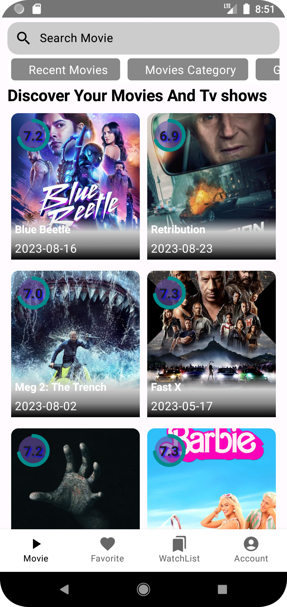
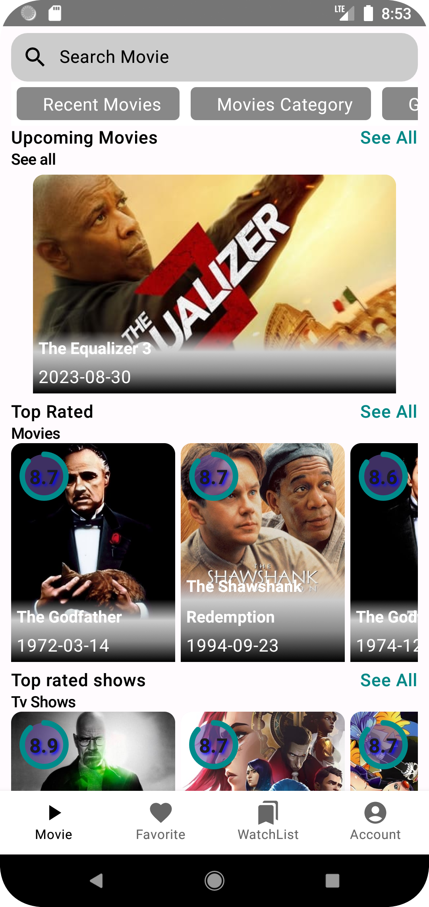
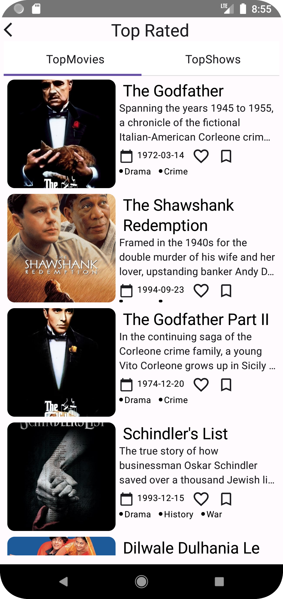
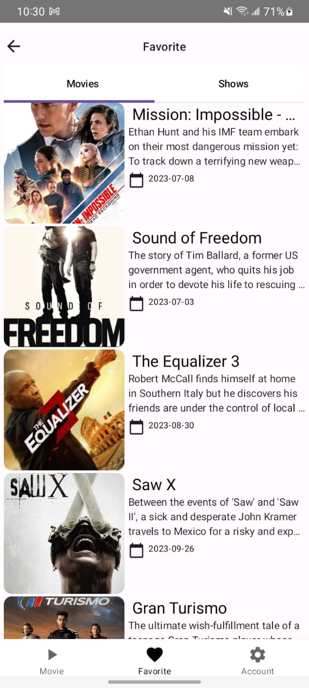
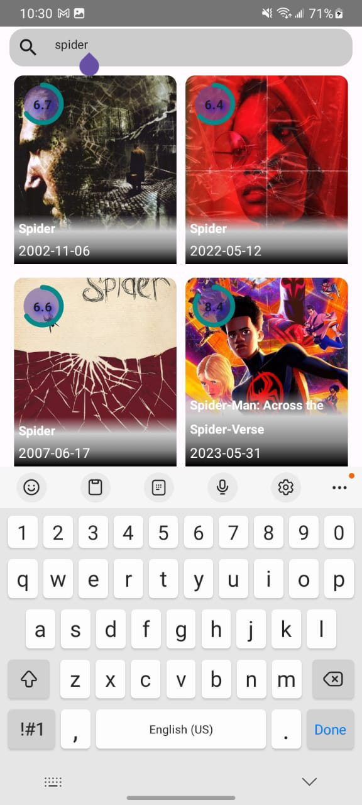
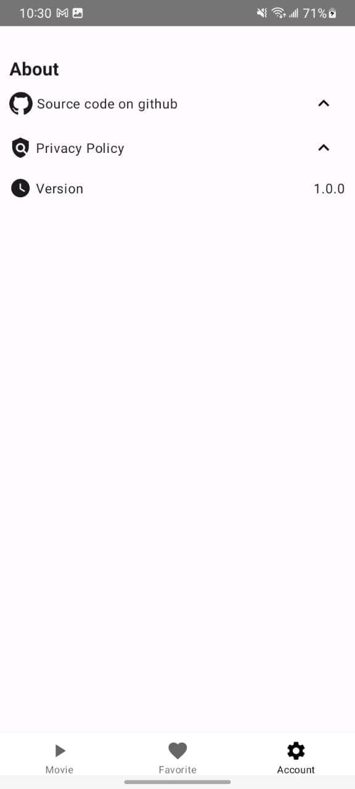

### GetMovies
Get Movies is an application that helps you find your favourite movies. You can get recommendations and also similar movies to the current selections. You can watch the previews of the movies that you select and this makes it easier.
Apart from this, you can have a list of favourites and also have a watchlist for the movies you are going to watch.
### Screenshot and Demo

#### Light Theme
Home Screen             |  Category Screen             | See All CAtegory Screen        | Detail Screen
:-------------------------:|:-------------------------:|:-------------------------:|:-------------------------:
  |    |  | 

Favourite Screen           | Search Screen             |  WatchList Screen             | Setting Screen
:-------------------------:|:-------------------------:|:-------------------------:
  |    | 


### Tools and library
The following tools and libraries were used to build this app;
- [Kotlin](https://kotlinlang.org/) - Kotlin is a programming language that runs on JVM with immense support from Google and the entire tech community.
- [Jetpack Compose](https://developer.android.com/jetpack/compose) - Jetpack Compose is the Android-recommended toolkit for building native UIs.It simplifies and accelerates UI development on Android. Quickly bring your app to life with less code, powerful tools, and intuitive Kotlin APIs.
- [Dagger Hilt](https://dagger.dev/hilt/)- Dagger Hilt is a dependency injection framework for Android. It is used in GetMovies to manage dependencies and provide a cleaner architecture.
- [View Models](https://developer.android.com/topic/libraries/architecture/viewmodel) - View Models are used in GetMovies to manage the app's UI-related data. They provide a way for the app to survive configuration changes, such as screen rotations.
- [Room Database](https://developer.android.com/training/data-storage/room) - Room Database is a persistence library used for storing data locally. It stores the tasks locally.

### Overall architecture
- MVVM(Model-view View-Model) architecture pattern. The model layer is responsible for fetching and storing data. The view layer is responsible for displaying the UI to the user. The ViewModel layer acts as the mediator between the view and model layers, managing the data flow and interactions.
- Clean architecture - This involves arranging the app file into modules. This makes your code clean and easy to understand.

### GetMovies packages
Arranging the app files into modules makes it easier to understand the flow of the app. These modules are such as;

#### Domain
The domain module is responsible for the application's business logic. It includes classes such as use cases, domain entities, and mappers. 
The use cases are the building blocks of the application's functionality, and they define what the application can do.

The domain entities represent the data model that the application uses, and they encapsulate the business logic of the application. The domain module interacts with the data models module to retrieve the data and then prepares it for presentation in the core module. It ensures the data is well organized, easy to manipulate, and ready for use by the application's user interface.

#### Data
The data  module is responsible for fetching data from the remote API and saving it to the local room database. It includes classes such as data sources, 
repositories, and entities that help define the data structure and access.

The data source classes are responsible for fetching data from the user. The repositories are responsible for combining data 
from different sources and providing them to the domain module. The entities are the data models that are stored in the local room database.

The data models module ensures that the data is available when needed, whether online or offline, by providing a centralized interface to access the data. This module makes it easy to modify data sources, migrate data, and provide data consistency and accuracy.

#### Presentation
Everything involving the User Interface is stored here. Here we have the activities, fragments and the view models.

## Getting Started

To clone the GetMovies project and run it on your local machine, follow these steps:

- Open your command line interface and navigate to the directory where you want to store the project.
- Type git clone https://github.com/jumapaul/GetMovies/.git and press Enter. This will download the project files to your local machine.
- Open Android Studio and click on "Open an existing Android Studio project" from the welcome screen. Navigate to the directory where you cloned the project and select it.
- Wait for Android Studio to build the project and download any dependencies. This may take a few minutes.
- Once the project is built, you can run it on an emulator or a physical device. To run the project, click on the green arrow in the toolbar at the top of the screen or select "Run" from the "Run" menu.

Note: Before running the project, make sure to check if you have the required tools and libraries installed, such as the Android SDK, Gradle, and any other dependencies specified in the project's build.gradle files. You may need to update these tools and libraries to their latest versions to avoid any compatibility issues.

## License

 ```
 MIT License
 
 Copyright (c) 2022 Juma Paul
 
 Permission is hereby granted, free of charge, to any person obtaining a copy of this software and 
 associated documentation files (the "Software"), to deal in the Software without restriction, including 
 without limitation the rights to use, copy, modify, merge, publish, distribute, sublicense, and/or sell 
 copies of the Software, and to permit persons to whom the Software is furnished to do so, subject to 
 the following conditions:
